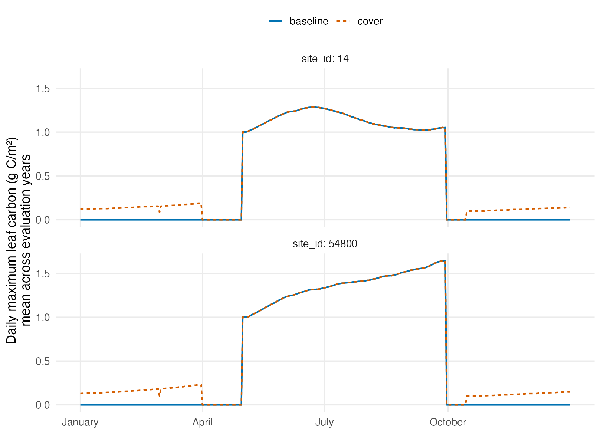
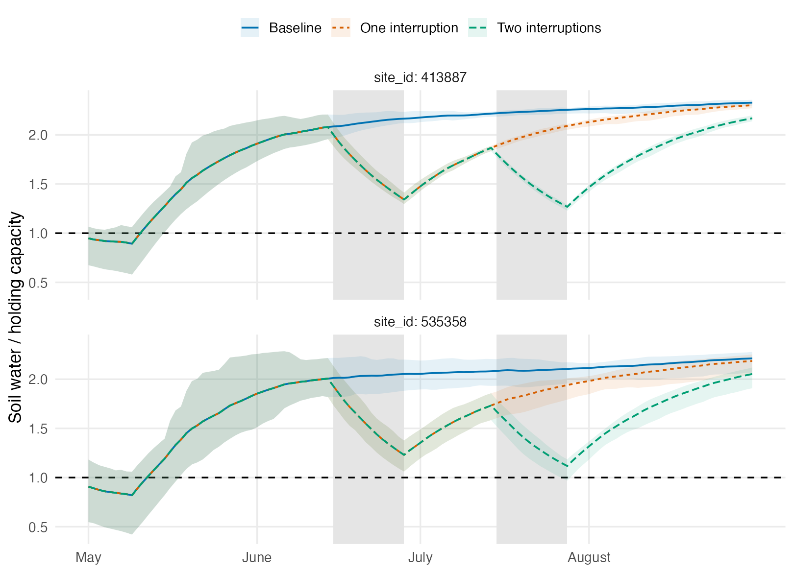

## Decision

**Retain the controlled-comparison approach as a useful design framework, and
revise the crop and water specifications before expanding it.** The pilot
successfully reuses prepared inputs and the model executable, branches paired
scenarios from identical states, and reproduces no-change controls exactly.
These checks establish that the experiment can be executed consistently.

The pilot does not yet establish realistic crop production or repeatable rice
drying. Those limitations concern the experiment and model representation,
not whether an effect agrees with the literature. No broad expansion or new
parameter-ensemble simulations were launched on these scenario definitions.
The verified 50-member calibration ensemble and tested aggregation code are
ready for comparisons that meet the implementation checks.

This is a model benchmark across California growing conditions, using the
existing 100 design points as the environmental sampling frame. It is not an
estimate of adoption benefits or an area-weighted statewide inventory.

## Design assessment

The scientific question is whether the model reproduces the direction and
approximate magnitude of practice effects under comparable crop systems,
environments, intensities, durations, and measured quantities. Historical
management can supply realistic context, but need not define the experiment.

| Approach | Use in this assessment |
|---|---|
| Repair existing management-derived scenarios | Retain as diagnostics; use directly where their intervention and comparison already match the question |
| Replace the whole workflow | Unnecessary: climate, soil inputs, PEcAn-written configurations, execution and conversion remain useful |
| Define controlled scenarios using existing infrastructure | Preferred candidate, conditional on pilot checks of baseline behavior and realized treatment |

The [candidate comparison matrix](../examples/4_controlled_benchmark/candidate_comparisons.csv)
records crop/environment support, explicit baselines, treatment changes,
frequency, duration, common preparation, evidence, outputs, capabilities and
reusable components. Its current dispositions are:

- **Revise:** annual cover cropping, annual tillage, rice water management, and
  orchard amendment comparisons need more explicit or better matched definitions.
- **Retain the contrast definition:** the mineral-N dose ladder can be reused for
  annual crops and forage. Species-specific N₂O interpretation remains deferred.
- **Defer:** orchard/vineyard understory needs concurrent vegetation; adding cover
  to standing forage also needs a clearly supported intervention and capability.
  Neither is an agronomic judgment against cover crops.

Porwollik et al. (2022) used explicit reference, cover-crop and tillage scenarios
with shared starting states and common forcing, comparing different management
durations. Their model-specific vegetation and preparation procedures are
precedent for asking these questions, not settings automatically transferable
to SIPNET. [Methods, Sections 2.2–2.5](https://bg.copernicus.org/articles/19/957/2022/)

## What was run

The final pilot contains **36 simulations: eight baseline preparations and 28
evaluation runs**, including eight no-change controls. Four locations are crossed
with 8- and 16-year preparation periods. Each pair shares the same full restart
checkpoint, model parameters, weather, and non-treatment operations.

| Locations | Crop representation | Contrast |
|---|---|---|
| 14 and 54800 | Existing annual-row PFT; a summer processing-tomato calendar | Winter fallow versus an annually established winter cover |
| 413887 and 535358 | Existing rice vegetation and rice-soil PFTs | Continuous irrigation schedule versus one or two interruptions |

The annual locations contrast 15.0 versus 17.2 °C and 18.8% versus 51.3% clay in
the frozen metadata. The rice locations contrast 16.4 versus 18.3 °C and 42.6%
versus 32.3% clay. These deliberately selected cases test behavior; they are not
a new sample intended to replace the full design.

The original 12-location rice-scenario aggregate includes only two rice
vegetation assignments, alongside six almond, three grass, and one corn
assignment. All have rice-soil parameters. The pilot requires both the rice
vegetation and soil assignments, while the original report retains its original
12-location results with that limitation stated.

### Explicit operations and preparation

The [executable specification](../examples/4_controlled_benchmark/pilot_spec.json)
sets summer annual establishment on May 1 and harvest on September 30. It
prescribes 200 kg mineral N/ha in two applications, a fixed weekly irrigation
schedule, conventional tillage, and explicit harvest/residue fractions. The N
rate lies within the UC processing-tomato guide's 140–280 kg/ha range. Dates,
water amounts and biomass inputs are diagnostic settings, not observations or
validated prescriptions. [UC production guide](https://anrcatalog.ucanr.edu/pdf/7228.pdf)

Cover is planted October 15 and terminated April 1, with no additional fertilizer
or irrigation. Cash-crop operations are unchanged. The first cover is planted
in autumn 2016, so seven full cover seasons end during the eight-year evaluation;
a final cover is growing at the endpoint. The annual-row PFT also represents the
cover, which limits crop-specific interpretation. Concurrent orchard understory
is not represented by substituting this sequential single-PFT comparison.

Rice establishment is May 15, with 160 kg N/ha before planting and soil irrigation
of 1 cm/day from May 10 to September 10. One interruption omits June 15–28
irrigation; the second also omits July 15–28. No drainage parameter or model
process was changed to force drying. The baseline is an explicit input schedule,
not a guarantee of a particular water depth.

Preparation repeats the archived 2016–2023 forcing backward in whole eight-year
blocks. It preserves leap-year alignment and tests preparation duration; it is
not reconstructed historical weather or a demonstrated equilibrium. All
subsequent simulations use the actual archived 2016–2023 forcing. Planting adds
leaf, stem and root carbon; a common planting definition is used in the baseline
and practice scenario. Full harvest is followed by checks of vegetation and GPP
in the intended bare periods.

## Diagnostic results

### Pairing and vegetation timing

All eight no-change controls have byte-identical raw outputs to their baselines.
Parameters, configuration, weather and restart checksums match within every
pair, and every evaluation has all
2,922 calendar days. Baseline winter fallow and the interval between cover
termination and cash-crop establishment have zero reported leaf carbon, fine-root
carbon and GPP. The specification therefore realizes planting and termination
without silently treating an unstaged year as a zero practice effect.

{#fig-pilot-growth width=100% fig-alt="Two location panels show average daily maximum leaf carbon across eight evaluation years after eight years of preparation. Baseline vegetation is absent in winter; the cover scenario has winter vegetation that disappears in April before the summer crop. Summer leaf carbon remains low in both scenarios."}

### Baseline production needs revision



The largest simulated leaf-area index is only 0.106 m²/m², and mean annual GPP
ranges from approximately 3 to 11 g C/m². These sparse canopies do not establish
credible production for the named crop systems. The result applies to these
planting inputs and parameterizations; it does not prove that all admissible
SIPNET configurations behave this way. Crop-establishment inputs, PFT traits,
and growth/phenology behavior need a focused check before the carbon response
is interpreted as a field-practice benchmark.

### Irrigation omission is not consistently realized drying

{#fig-pilot-water width=100% fig-alt="Two rice locations show soil water divided by model holding capacity. Lines are calendar-aligned means across eight evaluation years, ribbons are the across-year range, and gray windows mark June and July interruptions. Water usually remains above the dashed saturation threshold of one."}



The two-interruption scenario at location 535358 briefly falls below the model's
saturation threshold in some conditions. The other cases remain above it during
the interruptions, and the June interruption does not produce a corresponding
dry-down at either location. This is not a repeatable one- or two-drying-event
experiment comparable to the literature classes. A revised water-management
specification needs to represent the intended hydrologic intervention explicitly.
The model's threshold is a diagnostic, not a field measurement of ponded depth.

The dashed line is the holding-capacity threshold, not the source-run anaerobic
onset parameter. A [local follow-up](../examples/4_controlled_benchmark/RICE_DRYDOWN_FOLLOWUP.md)
found that neither pilot location reaches `fAnoxia = 0.286` under the archived
interruptions. It also verified that methane responds sharply once water falls
just below holding capacity. The limiting result is therefore failure to realize
the intended drainage, not an unresponsive methane equation.

A bounded local experiment then prescribed one June 19–28 dry-down and June 29
reflood. The revised analysis separates a California field-reference path, a
California-timed threshold stress test, and a reproductive-stage severe-field
path, and it adds a one-time drain followed by SIPNET's own water balance. The
field-reference target is 0.595 of available water. At the published
Carrijo field coordinate, SSURGO
available water maps the observed severe AWD25 endpoint to a ratio of
0.469–0.719. Realized daily minima are 0.528 and 0.477 at the two locations,
both within that field range under the survey mapping. Neither crosses
`fAnoxia`. A separate 0.25 severe-stress diagnostic crosses `fAnoxia` on two
days per year. That endpoint remains above mapped 15-bar water content at both
modeled sites. It is drier than the California observations but is bracketed by
medium and high severities realized in a USDA Arkansas field experiment. It is
therefore treated as field-attainable severe stress, not as safe AWD or a
validated California endpoint.

The reproductive-stage path starts July 15, reaches the 0.25 target July 24
at 70 days after planting, and refloods July 25. Its realized minima are 0.240
and 0.231, with two days at or below `fAnoxia` in every year. A USDA field
record shows that first cycles began 57–66 days after May 9 sowing and lasted
7–13 days before reflooding. The model interval starts 61 days after planting
and lasts 10 days, directly within those field bounds. Exact emergence and plot
coordinates are unavailable.

The one-time-drain treatment removes water above `soilWHC` at the July start,
omits irrigation for ten days, and then lets SIPNET evolve the water state. It
reaches only 0.838 and 0.698 at the two sites and never crosses `fAnoxia`.
Thus the prescribed severe path has field-supported timing and severity, but
the available model process does not generate it from a single drain. Reaching
the 0.25 target from `soilWHC` requires 9 cm of net storage loss, or 0.9 cm/day.
The maximum realized losses are only 1.94 and 3.63 cm, or 0.19 and 0.36 cm/day;
the required loss is 4.63 and 2.48 times larger. This is a net storage
comparison rather than a partitioned water budget. The
[calculation](../examples/4_controlled_benchmark/results/natural_drydown_gap.csv)
is retained with the run evidence.

During those intervals, mean evapotranspiration is only 0.170 and 0.268 cm/day,
and transpiration contributes 0.0034 and 0.0008 cm/day—2.0% and 0.3% of the
total. Simulated LAI is only 0.030–0.072 m²/m². The hydrologic failure therefore
links directly to the crop-establishment failure: adding a drain event without
correcting canopy development would still leave field drying underpowered.

The field-reference path reduces dry-period methane by about 95% and seasonal
methane by 9%–10%. Continuing to the threshold-stress endpoint changes the
seasonal result by less than 0.4 percentage point. Moving the severe path to
July reduces dry-period methane by 95.2% and 96.6% and seasonal methane by 9.4%
and 10.5% at the two sites. These results verify the methane response to
prescribed trajectories, but they do not validate hydrology: the script
externally changes restart-state water and records removals of up to 14.4 cm in
one step. A California comparison should use one model-supported
mid-season drain and verify the field-length dry period before methane magnitude
is interpreted.

The model-evolved one-time-drain treatment reduces dry-period methane by 94.4%
and 96.3% and seasonal methane by 8.4% and 9.3%. The source-run exponent near
100 therefore produces strong methane suppression even though the water state
remains well above `fAnoxia`.

The 9%–11% seasonal response is also below the 38%–66% reduction reported for
single 5–12 day California drains with comparable timing
([Perry et al. 2022](https://doi.org/10.1016/j.fcr.2021.108312)). Across all
field-supported start dates tested here, the best 5–12 day window contains only
4.4%–11.4% of baseline seasonal methane. Timing alone therefore cannot bridge
the response gap. The present inputs also lack a validated conversion from the
model's integrated `soilWater / soilWHC` ratio to measured volumetric water
content, so crossing `fAnoxia` is not evidence of field-equivalent drying.

California field measurements sharpen this limitation. Carrijo et al. (2018)
reported 47%–50% VWC under continuous flooding and minimum 0–15 cm VWC of
24%–28% under the most severe 10–12 day dry-down
([Field Crops Research](https://doi.org/10.1016/j.fcr.2018.02.026)). SIPNET
v2.2.0 documents `soilWater` as plant-available soil water and `soilWHC` as its
cap, so the appropriate physical comparison places ratio zero at the
wilting-point end of the available-water range, not at zero absolute VWC. The
archived run nevertheless provides no modeled storage depth or depth-resolved
hydraulic profile, so its integrated ratio is not a direct 0–15 cm VWC
measurement.

Current PEcAn interfaces expose an unresolved semantic inconsistency: the
generic water-balance code defines holding capacity as field capacity minus
wilting point, whereas the SIPNET configuration writer integrates saturation
VWC when a soil profile is supplied and the output adapter labels SIPNET's
available-water fraction as `SoilMoistFrac`. The archived runs supplied no soil
profile and retained the fixed 12 cm value, so this does not alter the frozen
run interpretation. It must be resolved before the comparison is promoted to a
production hydrology workflow.

A point query to USDA SSURGO provides an external site bound. The dominant
surface components at locations 413887 and 535358 have available-water
fractions of 0.270 and 0.210 and 15-bar VWC of 0.222 and 0.133. Mapping the
model ratio as `theta = theta_15bar + ratio * AWC` places `fAnoxia` at VWC
0.299 and 0.193. The 0.25 target maps to 0.290 and 0.186. Realized June stress
minima map to 0.286 and 0.182, and reproductive-stage minima map to 0.287 and
0.181—all above 15-bar water content.

The Carrijo coordinate maps to an Esquon surface horizon with 47% clay, close
to the reported 45%, 15-bar VWC of 0.165, and available water of 0.160. Its
observed 24%–28% VWC maps to available-water ratios of 0.469–0.719. This supports
the field-reference range but not the drier threshold-stress endpoint. At that
field site, `fAnoxia` maps to VWC 0.211 and the 0.25 target maps to 0.205,
3–8 percentage points below the observations. AWD25 reached approximately
−69 to −73 kPa without a reported yield reduction, but it does not demonstrate
the drier modeled endpoint. The
previous zero-based saturation calculation is retained as a sensitivity bound;
it maps `fAnoxia` below wilting and is inconsistent with the fixed-WHC run's
documented plant-available-water semantics. SSURGO remains mapped survey
evidence rather than a field measurement or source-run input, so the comparison
supports physical plausibility but does not validate either site's hydrology. The
[field-moisture bounds](../examples/4_controlled_benchmark/results/field_moisture_mapping.csv)
and [site soil mapping](../examples/4_controlled_benchmark/results/site_soil_hydraulic_mapping.csv),
plus the [field-site mapping](../examples/4_controlled_benchmark/results/field_site_soil_hydraulic_mapping.csv),
retain the calculations and provenance.

A USDA Arkansas comparison establishes a field-observed lower bound. At the
Dale Bumpers National Rice Research Center, an AWD30 field experiment on Dewitt
silt loam reached 0.23–0.37 VWC across four cycles, still above `fAnoxia` after
available-water normalization
([Fernandez-Baca et al. 2021](https://doi.org/10.3389/fpls.2020.612054)). A
separate two-year severity experiment reached approximately 0.30, 0.21, and
0.15 VWC (−14, −24, and −43 kPa) under low, medium, and high reproductive-stage
AWD stress. SSURGO properties for the mapped Dewitt surface horizon convert
these endpoints to available-water ratios of 0.95, 0.45, and 0.117. This uses
the research facility coordinate, which returns the same Dewitt series named in
the companion field study; the precise experimental plot coordinate is not
reported. Under that mapping, the high treatment crossed the equivalent SIPNET
threshold, and the modeled 0.25 target is bracketed by the medium and high field
severities. This supports field
attainability as severe stress, but not agronomic equivalence: high stress
reduced rice and red-rice yields by as much as 50% and 60%. The July model path
starts and ends within the observed first-cycle calendar range. Exact emergence
and plot coordinates remain unavailable, and the endpoint is realized only by
the prescribed trajectory rather than by the one-time-drain water balance.
See the [USDA timing record](https://www.ars.usda.gov/research/publications/publication/?seqNo115=370626),
the [USDA severity record](https://www.ars.usda.gov/research/publications/publication/?seqNo115=378751),
and [field-severity mapping](../examples/4_controlled_benchmark/results/field_severity_comparators.csv).

The archived
[parameter audit](../examples/4_controlled_benchmark/results/anaerobic_exponent_audit.csv)
also qualifies the methane result. The PFT bundle and statewide configuration
deliberately fix `anaerobicTransExp` at 99.98298 and drop that trait from the
posterior samples before PEcAN writes each run. The same archived `soil_rice`
posterior has a median of 9.97418. Changing only the exponent to that posterior
median leaves the water trajectory unchanged and yields an 88%–89% dry-period
methane decrease and 8.8%–10.0% seasonal decrease, compared with 95%–96% and
9%–11% under the fixed source-run value. The near-100 exponent is therefore a
documented modeling choice, not a fitted value or an accidental mapping error.
Neither value is accepted here as calibrated; the scientific justification for
using a common fixed exponent rather than the rice-soil posterior remains open.

### Effect magnitudes and preparation sensitivity



These diagnostic effects are retained regardless of sign. Soil-carbon changes
are calculated from the soil pool alone, with the final paired difference
divided by the eight-year evaluation period. Methane ratios use May 15–September
10 totals at each location; they are not averaged with other crop systems.
Long-term effects are not inferred from this eight-year experiment.

Preparation duration changes the carbon differences, even though vegetation
production and the principal water diagnosis are similar. Small positive carbon
responses and near-one methane ratios do not establish agreement or disagreement
with field evidence while the baseline and treatment limitations remain.

## Expansion and uncertainty

| Comparison | Decision | Evidence needed before expansion |
|---|---|---|
| Annual cover | Revise | Credible crop and cover growth; explicit physiology mapping; carbon-pool/depth alignment |
| Rice water | Revise | Repeated realized drying matched to the intended event class, alongside credible rice growth |
| Orchard understory | Defer | Concurrent vegetation capability and a source-matched understory contrast |
| N₂O quantities | Defer species-specific scoring | Verified N₂O representation; the current total-volatilization tracker is insufficient |

The design framework and working infrastructure are retained. Neither a model
response in the wrong direction nor a small effect is, by itself, a reason to
reject a comparison. Here the reasons to revise are crop plausibility and the
realization of the intended treatment.

The final calibrated process ensemble has 50 members. Its means reproduce the
three fitted soil values in the original matrix; experimental Salinas initial
states are excluded. The [export and aggregation implementation](../examples/4_controlled_benchmark/README.md)
preserves joint members and requires the same locations within each comparison
group. It aggregates within members before estimating intervals and fractions
above or below zero. No new ensemble response probabilities are reported because
the pilot does not yet justify expanding these scenario definitions.

## Reproducibility and verification

The [example README](../examples/4_controlled_benchmark/README.md), specification,
candidate matrix, input manifest, submission receipt, calibrated ensemble and
compact results are included with this report. Full model outputs and restart
states remain in the isolated Geo workspace identified in the submission receipt.
The original runs and evidence were not altered. Rebuild the tables and figures
with `Rscript reports/R/build_controlled_benchmark.R` from the repository root.

Calendar tests verify the no-change control, planting pool requirements,
chronology/leap dates, unchanged annual cash-crop operations, and irrigation-only
rice differences. Ensemble tests cover member-first aggregation and rejection of
duplicate, missing and nonfinite inputs. Model execution, paired-state checks,
output conversion and scientific suitability are assessed separately. The
installed PEcAn converter produced 224 annual files; all soil-carbon endpoint
and GPP-total checks passed against raw output (tolerances of 0.02 and
0.001 g C/m², respectively). Its runtime and compatibility wrapper are recorded
with the results. Methane uses raw outputs because this installed converter
does not expose a methane variable.

The log audit records nitrogen-balance warnings, with maximum reported absolute
residual 0.004162 g N/m² per affected step across preparation and evaluation.
There are no reported carbon-balance warnings; displayed carbon clamps round to
zero at the log's precision. These observations are not proof of exact mass
conservation. The warnings remain part of the numerical-quality assessment and
are not hidden by successful execution or file conversion.
