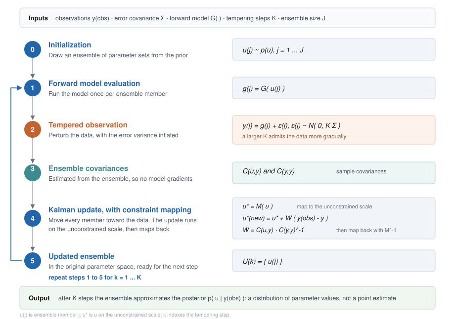
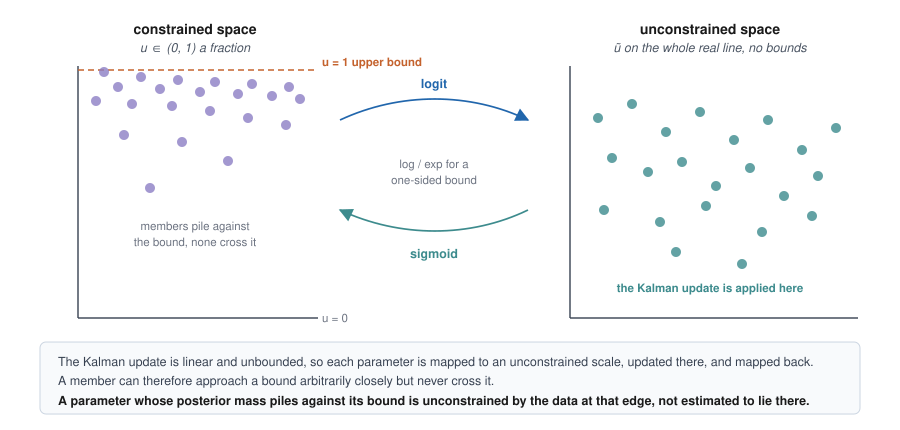

This report documents the calibration of SIPNET soil biogeochemistry parameters against
soil organic carbon observations from a single long-term field trial, and what that
calibration establishes about the model. The parameters estimated here are the values 
carried into the statewide inventory runs.

## Scope

Three soil process parameters and eight per-treatment initial soil carbon states were
estimated against the soil carbon record of the Salinas organic cropping systems trial
over 2005 to 2011 (White et al., 2020a, 2020b). Nitrous oxide from the Modesto
almond trial was withheld from the estimation, simulated, and scored as an independent
evaluation.

Sensitivity and uncertainty analyses are reported separately. Methane, and sites other
than the two named here, are outside this report.

## Calibration approach

Calibration is treated as a Bayesian inverse problem: estimate the parameter values, with
their uncertainty, that are consistent with the measurements given prior knowledge of
those parameters.

The estimator is tempered ensemble Kalman inversion (Iglesias et al., 2013). It requires
no model gradients, so SIPNET is used as released (Longfritz et al., 2026). An ensemble of
parameter sets is drawn from the prior, the model is run once per ensemble member, each
run is compared with the measured soil carbon, and the ensemble is moved toward the
observations by a Kalman-style update. The observations are admitted over several steps
rather than all at once (@fig-eki). The result is a distribution of parameter values
rather than a single best estimate.

{#fig-eki width=100% fig-align="center"}

Ecosystem parameters are bounded: rates are positive and fractions lie between zero and
one. The update is therefore not applied to the parameters directly. Each parameter is
mapped to an unconstrained scale, updated there, and mapped back (@fig-constraint). An
ensemble member can approach a bound arbitrarily closely but never cross it, which is how
the bounded results below should be read.

{#fig-constraint width=100% fig-align="center"}

Four choices keep the reported uncertainty conservative. The likelihood covariance is
inflated across the tempering steps so that the observations are admitted gradually; a
single update on a nonlinear model collapses the ensemble and understates the remaining
uncertainty. The observation covariance retains the shared control term, so the seven
treatment contrasts are not counted as seven independent measurements. Initial soil carbon
is estimated rather than fixed, so measurement error in the baseline propagates into the
result. Observation uncertainty is taken from the replicate structure of the trial rather
than assumed.

The report refers to the eight cropping systems by number throughout; each is defined in
the target table below. Systems 1 and 2 share the same cover crop schedule and differ only
in compost, so that pair isolates the compost effect. Systems 3 to 8 add an annual cover
crop as well as compost, so their differences from system 1 combine the two practices.

## Observations

Calibration and evaluation observations are separate in site, cropping system and
greenhouse gas. The evaluation set entered no part of the likelihood.

| set | site | system | measurement | period | contrast |
|---|---|---|---|---|---|
| calibration | Salinas | organic vegetables, eight systems | soil carbon stock, 0-30 cm | 2005-2011 | compost and cover crops against a no-compost control |
| evaluation | Modesto | almond orchard | nitrous oxide, chamber | 2018-2019 | compost against no compost |

Observation provenance, replicate structure and curation decisions are documented in the
data entry report for each site.

The fitted quantity is a period mean rather than an annual trajectory. The source study
reports that soil carbon levels were relatively stable from study years 2 through 8 and
analyses the mean over those years for each system (White et al., 2020a). Regression of
the curated stocks on year agrees: no system shows a significant trend over 2005 to 2011,
at a pooled slope of −0.33 ± 0.30 Mg C ha⁻¹ yr⁻¹ (p = 0.28, systems as a factor). An
annual target would ask the model to reproduce sampling variation.

Salinas soil carbon is therefore contracted to eight quantities: the no-compost control as
a period mean stock, plus each of the seven amended systems as a difference from that
control over the same window. A difference cancels the site effects the model is not
expected to carry, and the measured contrast is what a practice effect means for
inventory purposes. Uncertainty on each quantity is the standard error of the seven-year
mean, computed across years with the contrasts paired by year.

| system | compost | cover crop | value (Mg C ha⁻¹) | SE |
|---|---|---|---:|---:|
| 1, control | none | legume-rye, every fourth year | 23.46 | 1.19 |
| 2 | 7.6 Mg ha⁻¹ per crop | legume-rye, every fourth year | +9.46 | 0.99 |
| 3 | 7.6 Mg ha⁻¹ per crop | legume-rye annually, 1x seeding rate | +10.79 | 1.11 |
| 4 | 7.6 Mg ha⁻¹ per crop | legume-rye annually | +12.57 | 1.34 |
| 5 | 7.6 Mg ha⁻¹ per crop | mustard annually | +11.86 | 1.28 |
| 6 | 7.6 Mg ha⁻¹ per crop | mustard annually, 3x seeding rate | +12.18 | 1.59 |
| 7 | 7.6 Mg ha⁻¹ per crop | cereal rye annually | +11.68 | 1.62 |
| 8 | 7.6 Mg ha⁻¹ per crop | cereal rye annually, 3x seeding rate | +12.54 | 1.44 |

: System 1 is an absolute period-mean stock; systems 2 to 8 are differences from system 1
over the same window. The every-fourth-year cover crop in systems 1 and 2 was planted in
study years 3 and 7. Treatment definitions are from the curated trial record.

The compost-only comparison reproduces the mean effect of 9.4 Mg C ha⁻¹ published for the
same trial (White et al., 2020a), which is a reproduction check on the curation of the
calibration target rather than an independent one: both use the same underlying dataset.

Modesto nitrous oxide is contracted in the same way, to nine date-matched compost minus
no-compost contrasts, and then withheld.

## Estimated parameters

Parameter names follow the SIPNET parameter documentation; the SIPNET name is given in
parentheses.

| parameter | prior | role |
|---|---|---|
| SOM respiration rate (`baseSoilResp`) | uniform (0.003, 0.6) | soil organic matter respiration rate at 0 °C and saturated soil, g C g⁻¹ soil C yr⁻¹ |
| litter breakdown rate (`litterBreakdownRate`) | uniform (0.13, 1.2) | rate at which litter is converted to soil or respired, yr⁻¹ |
| litter fraction respired (`fracLitterRespired`) | uniform (0, 1) | of the litter broken down, the fraction respired rather than transferred to the soil pool |
| initial soil carbon, eight states (`soilInit`) | lognormal per system | one initial stock per treatment, kg C m⁻² |

Initial soil carbon is estimated rather than fixed, one value per treatment, with a
lognormal prior centred on that treatment's 2005 measurement at that measurement's error.
The 2005 sample is a measurement rather than the truth, and fixing the model to a single
draw forces a residual that the rate parameters can only absorb by moving onto their
bounds.

Three parameters were held fixed rather than fitted. The temperature sensitivity of soil
respiration (`soilRespQ10`) was set to 2.0 because it enters the same respiration term as
`baseSoilResp` and is not separately identifiable from a single soil carbon series. The
decomposition C:N scaling parameter (`kCN`) was set to 80 following a sweep from 2 to 1000
that gave a flat optimum. The optimum temperature of photosynthesis (`psnTOpt`) was set to
25 °C because the model derives its maximum photosynthetic temperature from the optimum,
and a lower optimum suppresses photosynthesis within the growing season temperature range.

The ensemble comprised 50 members over three tempering steps.

## Results

### Fit to the calibration observations

| quantity | observed | SE | before | after | residual before | residual after |
|---|---:|---:|---:|---:|---:|---:|
| system 1, no-compost control | 23.46 | 1.19 | 12.91 | 23.76 | −8.85 | +0.25 |
| system 2, compost | 9.46 | 0.99 | 14.23 | 10.76 | +4.82 | +1.32 |
| system 3 | 10.79 | 1.11 | 16.40 | 12.47 | +5.07 | +1.52 |
| system 4 | 12.57 | 1.34 | 17.71 | 14.56 | +3.83 | +1.48 |
| system 5 | 11.86 | 1.28 | 16.51 | 14.34 | +3.63 | +1.94 |
| system 6 | 12.18 | 1.59 | 18.15 | 14.95 | +3.76 | +1.75 |
| system 7 | 11.68 | 1.62 | 15.60 | 13.39 | +2.41 | +1.05 |
| system 8 | 12.54 | 1.44 | 16.90 | 15.34 | +3.04 | +1.95 |

: Stocks and contrasts in Mg C ha⁻¹. Residuals are the ensemble mean minus the observed
mean, in units of the observation standard error.

Root mean squared error falls from 5.96 to 2.04 Mg C ha⁻¹, and the same error expressed in
standard errors falls from 4.80 to 1.50. The no-compost control is recovered to within a
quarter of a standard error (@fig-fit). The seven treatment contrasts remain above their
measured values by 1.05 to 1.95 standard errors (@fig-residuals).

![Soil carbon parameter calibration for the 2005 to 2011 mean baseline stock and the seven treatment-baseline contrasts. The two panels carry different quantities: the left is an absolute stock for system 1, the right is each amended system's difference from system 1, and the two y axes are independent. Brackets below the right panel group the systems by treatment. Grey points show prior ensemble members and blue points calibrated ensemble members, 50 in each; horizontal bars show ensemble means. Red lines show observed means and shaded bands observed means ± 1 SE.](figures/fig1_calibration_fit.png){#fig-fit width=100% fig-align="center"}

{#fig-residuals width=100% fig-align="center"}

### Estimated parameter values

| parameter | prior mean | calibrated mean | variance reduction | 5th to 95th percentile | upper bound | identified |
|---|---:|---:|---:|---:|---:|---|
| SOM respiration rate | 0.291 | 0.072 | 98 percent | 0.037 to 0.133 | 0.6 | yes; the interval occupies 16 percent of the prior range, well clear of both bounds |
| litter breakdown rate | 0.618 | 0.931 | 55 percent | 0.538 to 1.189 | 1.2 | weakly; the interval still spans 61 percent of the prior range |
| litter fraction respired | 0.531 | 0.928 | 93 percent | 0.747 to 0.995 | 1.0 | no; 58 percent of members lie in the top 5 percent of the range |

The eight initial soil carbon states are reduced in variance by 44 to 87 percent. Taking
the shift as the calibrated mean minus the 2005 anchor, in units of the prior standard
deviation, five of the eight move less than 0.6, systems 7 and 8 move 1.0, and system 1
moves 1.5.

{#fig-params width=100% fig-align="center"}

The SOM respiration rate is the estimate this calibration provides: 0.072 g C g⁻¹ soil C
yr⁻¹, a 98 percent reduction in variance, with its 5th to 95th percentile occupying 16
percent of the prior range and clear of both bounds (@fig-params).

Both litter parameters moved upward, and the litter fraction respired reached the upper
limit of its support: 58 percent of its members lie in the top 5 percent of the range.
By the argument of @fig-constraint, that is a parameter the observations do not constrain
at that edge rather than one estimated to lie there. It is unconstrained rather than
calibrated, and should be carried forward as its prior distribution or left at the model
default rather than quoted as a fitted value.

The litter breakdown rate is an intermediate case. Its mean moves from 0.618 to 0.931 and
its variance falls by 55 percent, but its 5th to 95th percentile still spans 61 percent of
the prior range and only 8 percent of members lie in the top 2 percent of that range. It
is weakly constrained by these observations, not pinned against its bound, and should not
be quoted as a fitted value either.

{#fig-joint width=100% fig-align="center"}

@fig-joint shows the two parameters together.

{#fig-states width=100% fig-align="center"}

System 1 moves furthest (@fig-states), which is expected: it is the state the period-mean
baseline stock bears on most directly.

{#fig-effect width=100% fig-align="center"}

On the absolute scale the calibrated ensemble interval overlaps the measured interval in
all seven study years, and contains the measured mean in three of seven (@fig-effect,
left). The measured effect varies between 6.75 and 14.50 Mg C ha⁻¹ with no significant
trend, at a slope of +0.50 ± 0.49 Mg C ha⁻¹ yr⁻¹. The modeled effect accumulates
monotonically before calibration, from 10.5 Mg C ha⁻¹ in study year 2 to 18.2 in study
year 8, a slope of +1.19. After calibration the slope falls to +0.23 and the series is no
longer monotonic, running from 9.8 to 12.1. The measured points in this figure are the
same Salinas record used for calibration, decomposed by year, not additional observations.

The relative panel is plotted on a logarithmic scale because the prior mean reaches 413
percent of the control stock at study year 7 (@fig-effect, right). That value is a
property of the prior rather than of the model: the prior range for the SOM respiration
rate reaches 0.6 per year, which draws the control's soil carbon as low as 1.1 Mg C ha⁻¹,
so any ratio taken against it is large. After calibration the modeled relative effect runs
from 33 to 64 percent against a measured 30 to 56 percent.

### Performance diagnostics
 
We evaluate calibration performance using prediction-interval coverage, mean bias, root
mean squared error, and measurement uncertainty. These diagnostics assess whether the
calibrated ensemble remains consistent with the observations and whether the reduction in
ensemble spread is accompanied by systematic error.
 
| diagnostic | before | after |
|---|---:|---:|
| observations within the 90 percent prediction interval | 8 of 8 | 3 of 8 |
| coverage | 100 percent | 37.5 percent |
| 95 percent Agresti-Coull interval on coverage | 63 to 100 percent | 13 to 70 percent |
| mean bias (Mg C ha⁻¹) | +2.98 | +1.88 |
| root mean squared error (Mg C ha⁻¹) | 5.96 | 2.04 |
| pooled measurement uncertainty (Mg C ha⁻¹) | 1.34 | 1.34 |
| absolute bias below pooled measurement uncertainty | no | no |
 
: Bias is the mean of modeled minus observed across the eight quantities. Pooled
measurement uncertainty is the root mean square of the eight observation standard errors.
The prediction interval is the 5th to 95th percentile of the ensemble. Coverage intervals
are Agresti–Coull (Agresti and Coull, 1998); with eight observations they are wide enough
that neither coverage figure is precisely estimated.
 
The prior covers all eight observations, but that reflects a prior wide enough to contain
any outcome rather than a model that predicts well. The calibrated ensemble is narrower
and its root mean squared error is a third of the prior value, but five of eight
observations now fall outside the prediction interval and the mean bias of +1.88 Mg C ha⁻¹
remains larger than the pooled measurement uncertainty of 1.34. The contraction in spread
is therefore accompanied by a systematic error that no choice of these three parameters
removes; its source is the one-signed residual described below.

## Independent evaluation

The nine Modesto nitrous oxide contrasts were withheld from the likelihood. No nitrogen
parameter was estimated in this calibration, so this comparison measures what is currently
unconstrained. The soil carbon parameters do affect the modeled flux, through the soil
carbon and nitrogen pools, but no observation in the likelihood bears on the nitrogen
cycle directly.

Averaged over the nine measured dates the modeled compost arm emits 103 g N₂O-N ha⁻¹ d⁻¹
against a measured 1.3, approximately eighty times the measurement (@fig-validation, a).
Calibrating soil carbon moved that value from 174 to 103 g N₂O-N ha⁻¹ d⁻¹, so the
difference is a structural discrepancy rather than a calibration residual.

![Modeled against measured nitrous oxide at Modesto across nine date-matched chamber measurements. a) daily flux of the compost arm, on logarithmic axes because the quantity is strictly positive and spans three orders of magnitude. b) the compost minus no-compost contrast, which is the quantity that was withheld, on linear axes because it takes both signs. Grey points are the prior ensemble and blue points the calibrated ensemble; error bars show 90 percent posterior prediction intervals on the modeled value. The red dashed line is the one-to-one line. Modeled and measured values cover the same days.](figures/fig7_n2o_evaluation.png){#fig-validation width=100% fig-align="center"}

Evaluated by the metrics used for soil carbon above:

| criterion | prior | calibrated |
|---|---:|---:|
| contrasts within the 90 percent prediction interval | 2 of 9 | 0 of 9 |
| coverage | 22 percent | 0 percent |
| 95 percent Agresti-Coull interval on coverage | 5 to 56 percent | 0 to 34 percent |
| mean bias (g N₂O-N ha⁻¹ d⁻¹) | +13.65 | +26.49 |
| root mean squared error (g N₂O-N ha⁻¹ d⁻¹) | 21.65 | 41.65 |
| pooled measurement uncertainty (g N₂O-N ha⁻¹ d⁻¹) | 1.35 | 1.35 |
| absolute bias below pooled measurement uncertainty | no | no |

: Metrics are defined as for the soil carbon table above, over the nine withheld
contrasts.

Calibrating soil carbon reduced the modeled flux of each arm but increased the modeled
difference between them: mean bias on the withheld contrast rises from +13.65 to +26.49 g
N₂O-N ha⁻¹ d⁻¹, and coverage falls from 2 of 9 to 0 of 9. The soil carbon parameters enter
the nitrogen cycle through the soil carbon and nitrogen pools, so this is a consequence of
the soil carbon fit rather than an independent failure, and it is one more reason to
estimate the nitrogen parameters against nitrogen measurements before using these outputs.

Eight of the nine measured contrasts lie within two standard errors of zero. The
measurements constrain the compost effect on nitrous oxide to be near zero, and the model
places it between 1.3 and 96 g N₂O-N ha⁻¹ d⁻¹. All nine modeled contrasts are positive and
every point lies above the one-to-one line (@fig-validation, b).

## Interpretation: the amendment carbon pathway

All seven amended systems remain above their measured contrast after calibration, every
residual with the same sign, between 1.05 and 1.95 standard errors.

The three fitted parameters are global rather than per-treatment, so a one-signed residual
is also what a mis-set parameter would produce; the sign pattern alone does not separate
the two explanations. What separates them is that the estimator was free to remove the
bias and did not. The litter fraction respired reached the upper limit of its support in
the attempt, and the bias remains. Within the admissible range of these three parameters
there is no setting that reproduces both the baseline stock and the practice effects.

Both litter parameters moved upward, and both act to move carbon away from the soil pool:
a larger respired fraction leaves less broken-down litter to transfer, and a faster
breakdown rate moves litter through that split sooner. The litter fraction respired
reaches the upper limit of its support doing so. SIPNET routes all
organic carbon added by a management event into the fresh litter pool with residue
kinetics, so composted material, which is partly stabilized on arrival, is treated as
fresh residue. The model retains amendment carbon it should not, and the only channels
available to remove it are the two litter parameters.

Comparable soil carbon accounting models give exogenous organic matter its own quality
partition. RothC treats farmyard manure separately from crop residue, and the RothC-EOM
extension adds decomposable, resistant and humified amendment pools whose partitioning
factors are fitted per amendment type (Mondini et al., 2017). The corresponding gap in
SIPNET has been filed for model development.

## Restrictions on application

1. The parameters are conditioned on one site, one cropping system and one soil, over
   seven years, in an intensively tilled irrigated vegetable soil. Application to
   orchards, rice or rangeland is extrapolation.
2. The parameters are conditioned on soil carbon alone. Nitrous oxide and methane outputs
   produced with them are uncalibrated, and the one nitrous oxide comparison available
   differs from the measurement by approximately eighty times. They should not
   be used for a nitrous oxide or methane estimate without separate calibration.
3. Only the SOM respiration rate is reported as calibrated. The litter fraction respired
   rests against the upper limit of its support, so its spread understates its
   uncertainty; the limit rather than the observations sets the upper edge. The litter
   breakdown rate is only weakly constrained, its 5th to 95th percentile still spanning
   61 percent of the prior range. Neither should be quoted as a fitted value.
4. Modeled practice effects are above the measurement at every treatment tested. Practice
   effects taken from this parameterization are upper estimates.
5. Prediction interval coverage and mean bias do not meet the criteria applied in soil
   carbon offset reporting. An uncertainty deduction derived from this posterior alone
   would not be conservative, because the dominant error is structural rather than
   parametric.
6. The temperature sensitivity of soil respiration is held fixed because a single soil
   carbon series cannot separate it from the SOM respiration rate. Its contribution to
   uncertainty is not represented.
7. Meteorology and management are held at a single realization, so the posterior spread is
   a parameter range under fixed inputs rather than a full calibration uncertainty.

## Next steps

1. Add an amendment carbon partition to SIPNET so that a fraction of organic carbon added
   by a management event enters the soil pool directly rather than all of it entering
   fresh litter, and re-estimate the soil parameters.
2. Estimate the nitrogen cycling parameters against nitrogen measurements. The Modesto
   result measures what is currently unconstrained; it is not grounds for further
   adjustment of the soil carbon parameters.
3. Evaluate the re-estimated parameters against a longer independent soil carbon record,
   including the Russell Ranch century experiment (Wolf et al., 2018), using an
   observation operator matched to that trial's sampling design.
4. Replace the uniform priors with informed distributions. A uniform prior asserts that
   every value in its range is equally probable and that no value outside it is possible;
   neither holds for these parameters. The finding that the litter fraction respired is
   unconstrained at its upper edge is in part a consequence of that choice, since the
   prior places as much weight on complete respiration of litter as on any other value.
5. Draw the initial ensemble with a quasi-random or stratified sampler. The ensemble is
   currently drawn independently per parameter by pseudo-random sampling, which leaves
   coverage of the joint parameter space to chance at an ensemble size of 50. Halton,
   Sobol and Latin hypercube designs are available in PEcAn and would give more even
   coverage for the same number of model runs.

## Key artifacts

- Multi-site calibration code: <https://github.com/ccmmf/calibration>
- Collected observations for calibration and evaluation: <https://github.com/ccmmf/cal-val-data>
- Calibration run record: <https://github.com/ccmmf/organization/issues/272>
- Amendment carbon partition request: <https://github.com/PecanProject/sipnet/issues/396>
- SIPNET parameter documentation: <https://pecanproject.org/sipnet/parameters/>

## References

Agresti, A., & Coull, B. A. (1998). Approximate is better than "exact" for interval
estimation of binomial proportions. *The American Statistician*, 52(2), 119--126.
https://doi.org/10.1080/00031305.1998.10480550

Iglesias, M. A., Law, K. J. H., & Stuart, A. M. (2013). Ensemble Kalman methods for
inverse problems. *Inverse Problems*, 29(4), 045001.
https://doi.org/10.1088/0266-5611/29/4/045001

Longfritz, M., Sacks, W. J., Moore, D. J. P., Zobitz, J. M., Braswell, B. H., Schimel,
D. S., Kooper, R., Dietze, M. C., Fer, I., Black, C., & LeBauer, D. S. (2026). SIPNET:
Simple Photosynthesis and Evapotranspiration Model (v2.2.0) [Software]. Zenodo.
https://doi.org/10.5281/zenodo.22286320

Mondini, C., Cayuela, M. L., Sinicco, T., et al. (2017). Modification of the RothC model
to simulate soil C mineralization of exogenous organic matter. *Biogeosciences*, 14(13),
3253--3274. https://doi.org/10.5194/bg-14-3253-2017

White, K. E., Brennan, E. B., Cavigelli, M. A., & Smith, R. F. (2020a). Tradeoffs in cover
cropping impact net N mineralization, nitrous oxide emissions, and vegetable yields in an
organic production system. *PLOS ONE*, 15(1), e0228677.
https://doi.org/10.1371/journal.pone.0228677

White, K. E., Brennan, E. B., & Cavigelli, M. A. (2020b). Soil carbon and nitrogen data
during eight years of cover crop and compost treatments in organic vegetable production.
*Data in Brief*, 33, 106481. https://doi.org/10.1016/j.dib.2020.106481

Wolf, K. M., Torbert, E. E., Bryant, D., et al. (2018). The Century Experiment: The first
twenty years of UC Davis' Mediterranean agroecological experiment. *Ecology*, 99(2), 503.
https://doi.org/10.1002/ecy.2105
