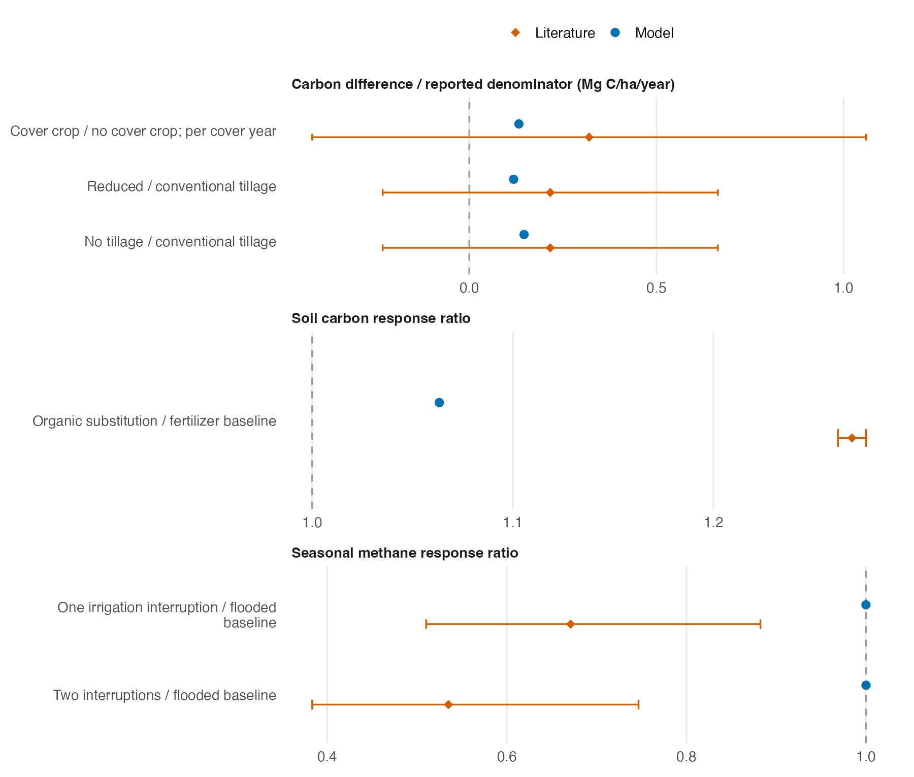
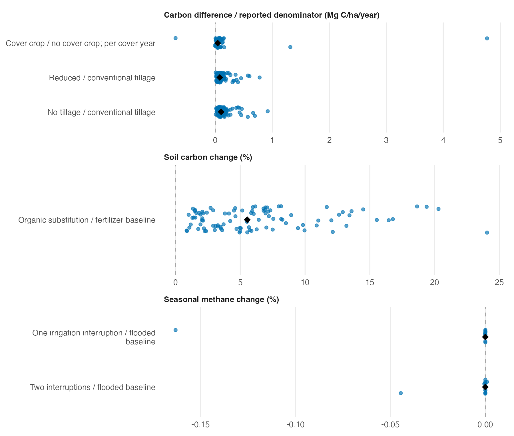

## What this benchmark shows

Across California growing conditions and crop systems represented by the fixed
statewide design, does the model reproduce the direction and approximate
magnitude of practice effects reported in the literature? This report evaluates
that question using paired management simulations at 99 of the 100 design
points over 2016–2023. One point was excluded because its initial pools were
unusable. These are design-point simulations, not the empirical sites used for
model calibration or evaluation. The experiment uses one fixed
parameterization and does not estimate statewide adoption benefits.

**The simulations produce positive carbon responses to cover crops, reduced
and no tillage, and organic substitution.** Their reported averages are smaller
than the selected synthesis estimates. However, differences in carbon pools,
treatment exposure, and comparison periods limit interpretation of the magnitude.
The rice scenarios produce very small methane changes. Modeled N₂O-N responses
are reported as exploratory diagnostics because nitrogen parameters were not calibrated.

The paired simulations provide a working basis for testing management responses.
The companion pilot evaluates controlled crop-system comparisons using this
infrastructure. It identifies crop-growth and rice-drying requirements to resolve
before propagating the calibrated parameter ensemble. Agreement with the
literature is an outcome of that test, not a condition for retaining a result.

## Comparisons and coverage

The 100 design points form the fixed environmental sampling frame for this
experiment. Each practice-change scenario is compared with its baseline at the
same design point. Treatment-minus-baseline effects therefore hold weather,
initial conditions, parameters, and model configuration constant within each
pair and change the management events. The historical calendars and
scenario-preparation assumptions determine when the practice is applied in
these existing runs.

| Practice | Baseline | Locations analyzed | Interpretation |
|---|---|---:|---|
| Cover crop | No cover crop | 65 | Cover is prepared in eligible years, not necessarily every year |
| Reduced or no tillage | Conventional tillage | 99 each | Prescribed tillage intensity differs |
| Organic substitution | Fertilizer baseline | 99 | The comparison includes the specified nutrient substitution |
| Mineral fertilizer rates | Zero-N and reference-rate scenarios | 99 | Dose-response diagnostics; 3 N-fixing and 96 other locations |
| Rice irrigation interruptions | Flooded rice baseline | 12 each | One or two interruption schedules; realized drying requires verification |

Cover crops are evaluated at 65 locations. Mixed perennial–understory systems
are uncommon in CADWR land-use data and were not included in the CARB-provided
scenarios, although the model can represent them. Unprepared scenarios are not
treated as zero effects.

## Estimated responses

The following values retain the archived calculations and comparison populations.
Averages describe treatment-minus-baseline effects across the design points in
each comparison; they are not acreage-weighted statewide means. Literature
syntheses provide context for the direction and magnitude of these paired model
responses. Response ratios (RR) are practice divided by baseline; RR = 1
indicates no change. Average response ratios are calculated on the log scale
and converted back to ratios; they are not ratios of regional totals.



For cover and tillage, the carbon quantity is **soil plus litter**, whereas the
organic-substitution ratio uses **soil carbon alone**. The cover estimate is the
final paired difference divided by the number of prepared cover years; tillage
uses the eight-year simulation window. These are the existing calculations,
not interchangeable estimates of a common annual SOC accumulation rate.
The correspondence between model pools and measured sampling depth also needs
resolution before quantitative agreement is assessed.

{#fig-effects width=100% fig-alt="Blue circles show the model and orange diamonds the literature. Carbon effects are positive; methane response ratios are nearly one. Carbon-rate bars show one literature SD; ratio bars show approximate 95 percent intervals. Each comparison lists its location count."}

In @fig-effects, literature bars show the archived among-unit SD for carbon
rates and approximately 95% confidence intervals (mean ± 1.96 SE, transformed
from log ratios) for amendments and methane. These describe different sources
of variation. Model points have no parameter-uncertainty bars because only one
parameterization was run. Pool, duration, and scenario differences make these
contextual comparisons rather than calibrated agreement tests.

### Carbon

Cover crops produce an average soil-plus-litter difference of 0.13 Mg C ha⁻¹
per prepared cover year. Reduced and no tillage produce 0.12 and 0.15
Mg C ha⁻¹ per simulation year, respectively. The corresponding synthesis
centers are 0.32 for cover and 0.22 for tillage. Their relative magnitudes
identify useful comparisons to revisit after matching pools and durations;
they do not by themselves establish underprediction of measured SOC.

Replacing mineral fertilizer with organic amendments increases modeled soil carbon
by about 6% across the design points, compared with 27% in the selected synthesis.
Amendment composition,
application rate, nutrient substitution, and duration matter to this contrast.
An amendment-pool partition is a candidate model investigation, not an
established explanation or correction for the difference.

### Methane

The rice scenarios schedule one or two interruptions of flooding, intended to allow
drying before reflooding. They produce effectively no modeled methane change, whereas
the corresponding literature estimates are 33% and 47%
reductions. Daily water trajectories and irrigation inputs must show
that drying actually occurred before interpreting this as a test of alternate
wetting and drying. Of these 12 locations, the prepared vegetation parameters
represent rice at two, almond at six, grass at three, and corn at one. All have
rice-soil parameters. The archived average is therefore a rice-scenario
diagnostic across mixed vegetation assignments, not a matched rice-crop estimate.

### Variation among locations

{#fig-locations width=100% fig-alt="Each blue dot is one location's paired effect. Separate axes show carbon rates, soil carbon percentage change, and methane percentage change. Black diamonds mark medians. No modeled-location counts are displayed. No tails are clipped; several cover-crop responses differ substantially from the median."}

@fig-locations separates spatial variation from uncertainty in a synthesis mean.
The full location distributions reveal skew and near-zero responses that an
average can conceal. The fraction of locations with a positive response is a
spatial summary at fixed parameters, not a posterior probability that the
practice increases carbon.

## Nitrous oxide diagnostics

The modeled N₂O-N flux is evaluated here as a diagnostic because nitrogen parameters
were not calibrated and the comparison populations differ from the syntheses.

The modeled no-tillage response is −2.4% over 2016–2020. The curated dry-climate
N₂O evidence is duration-dependent: approximately **38% higher** emissions for
experiments shorter than ten years and **34% lower** for experiments lasting
ten years or more (van Kessel et al., 2013). These are area-scaled effects.
The current eight-year experiment does not test the long-duration class, and
the short-duration aggregate includes crop systems that need eligibility
checks against the source, including flooded rice.

The fertilizer diagnostic has an almost flat emission-factor response to N
rate at the tested parameters. This does not establish that other
parameterizations have the same response.

## Methods and scope of inference

The simulations use SIPNET v2.2.0 with nitrogen cycling, anaerobic decomposition,
flooding, and the litter pool enabled. Plant and soil traits use the prepared
PFT medians. Seven shared parameters are fixed across runs: photosynthesis
optimum, soil respiration rate, litter breakdown rate, litter fraction respired,
soil respiration temperature sensitivity, decomposition C:N scaling, and the
anaerobic transfer exponent. The three fitted soil-process values are means
of the 50-member calibration ensemble; the remaining PFT traits use medians and vary by PFT. One fixed parameterization
is used, with shared meteorology and initial conditions within each pair.

Effects are calculated for each location and then summarized once per
practice–outcome comparison. The literature is not treated as an independent
observation at every location. Evidence is matched by practice, outcome, and
subclass; an emission-factor level, its response to fertilizer rate, and a
flux ratio are distinct quantities. Overlapping synthesis groups should not
be counted as independent evidence.

The soil parameters come from the companion site-level calibration. This
benchmark is a transfer assessment across growing conditions and crop systems.
It is not established as independent validation: overlap between the primary
studies in the syntheses and calibration observations has not been audited.
The calibrated soil parameters also do not imply calibration of gas-specific
processes or comprehensive uncertainty coverage.

## Controlled-design assessment and next analyses

A [four-location controlled pilot](controlled_benchmark.qmd) now evaluates
explicit crop calendars, common restart states, and realized treatment effects.
Its no-change checks pass, but low crop growth and incomplete rice drying
require revision before expansion. The original numerical results above remain
unchanged.

Revise the pilot's crop establishment and water-management definitions, then
repeat the checks of plausible production, treatment exposure, and common
initial conditions. Retain the existing climate, soils, input preparation and
execution workflow. Existing management-derived scenarios remain useful
contextual diagnostics.

Compare results within crop systems, relevant environments, intensities, and
durations. Expand a comparison only when its treatment and measured quantity
are represented correctly; an opposite-direction response is still a valid
result. Unsupported orchard understory remains a capability gap.

Then run paired parameter ensembles and summarize each member over the same
comparison group before estimating an effect interval and its fraction above
or below zero (or RR = 1). Call these conditional ensemble fractions until their
posterior interpretation is justified. Compare compatible model and evidence
distributions; exact equality has zero probability for continuous quantities.
A single statewide average would obscure the conditions that define the test.

## Reproducibility

The [frozen inputs](data/statewide/manifest.json) include source locations,
checksums, and report, workflow, and evidence revisions. The
[figure and table generator](R/build_statewide_report.R) reads this bundle and
checks that all six main model estimators reproduce the archived scorecard.
Run it from the repository root with
`Rscript reports/R/build_statewide_report.R`, followed by
`quarto render reports/statewide_effects.qmd`.

Raw model outputs remain on Geo. The staging manifest describes `setup_v1`,
whereas the reported numerical outputs come from `pecan_v1`; those identities
are recorded separately. The frozen values are preserved, but this report
render is not an independent rerun of the original model or an audit of every
runtime dependency. No model is executed during rendering.

## Additional N₂O-N comparisons

The following comparisons retain the archived model and literature values.
They are exploratory because the nitrogen parameters were not calibrated and
the treatment and measurement definitions are not fully matched.
The rice literature entries use an assumed sensitivity spread rather than an
empirical uncertainty interval; no interval is plotted for them.



## References

The frozen evidence files retain each source, quantity, and extraction locator.
Principal sources are Poeplau and Don (2015), cover-crop carbon
[doi:10.1016/j.agee.2014.10.024](https://doi.org/10.1016/j.agee.2014.10.024);
Sun et al. (2020), conservation-agriculture carbon; Bai et al. (2023), amendment
carbon [doi:10.1016/j.catena.2023.107343](https://doi.org/10.1016/j.catena.2023.107343);
van Kessel et al. (2013), duration-dependent tillage N₂O
[doi:10.1111/j.1365-2486.2012.02779.x](https://doi.org/10.1111/j.1365-2486.2012.02779.x);
Jiang et al. (2019), rice water management; Shcherbak et al. (2014), fertilizer
response; and Cayuela et al. (2017), Mediterranean emission factors.

SIPNET v2.2.0: [release and source](https://github.com/PecanProject/sipnet/releases/tag/v2.2.0).
Controlled-scenario precedent: Porwollik et al. (2022),
[Biogeosciences 19, 957–977](https://bg.copernicus.org/articles/19/957/2022/).
